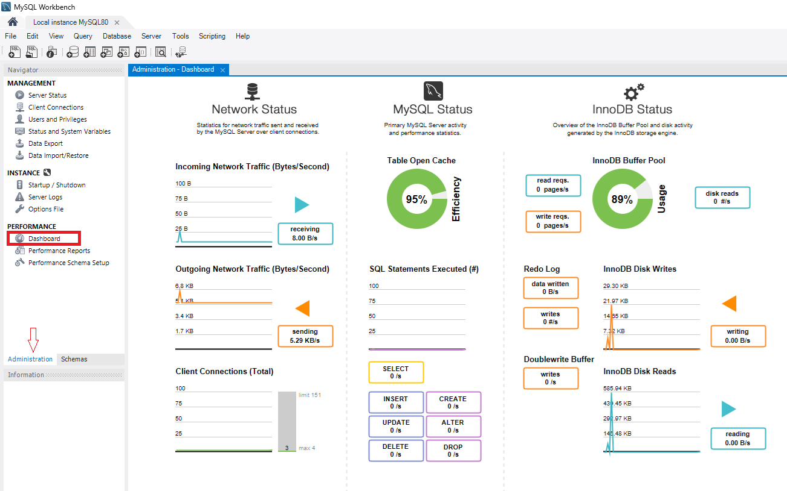
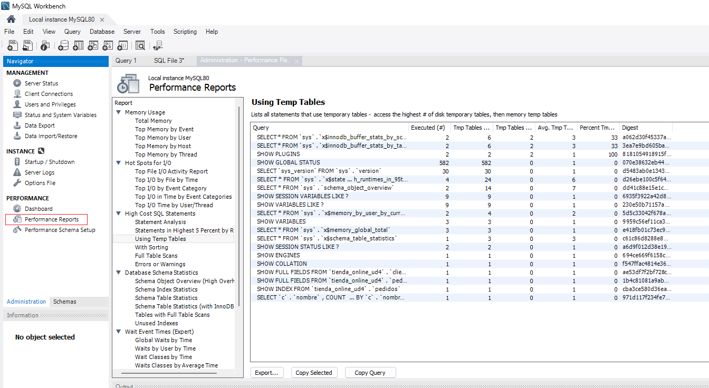
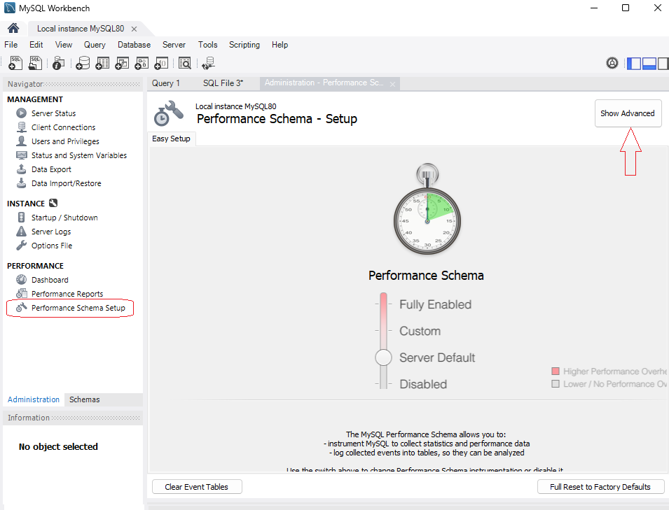
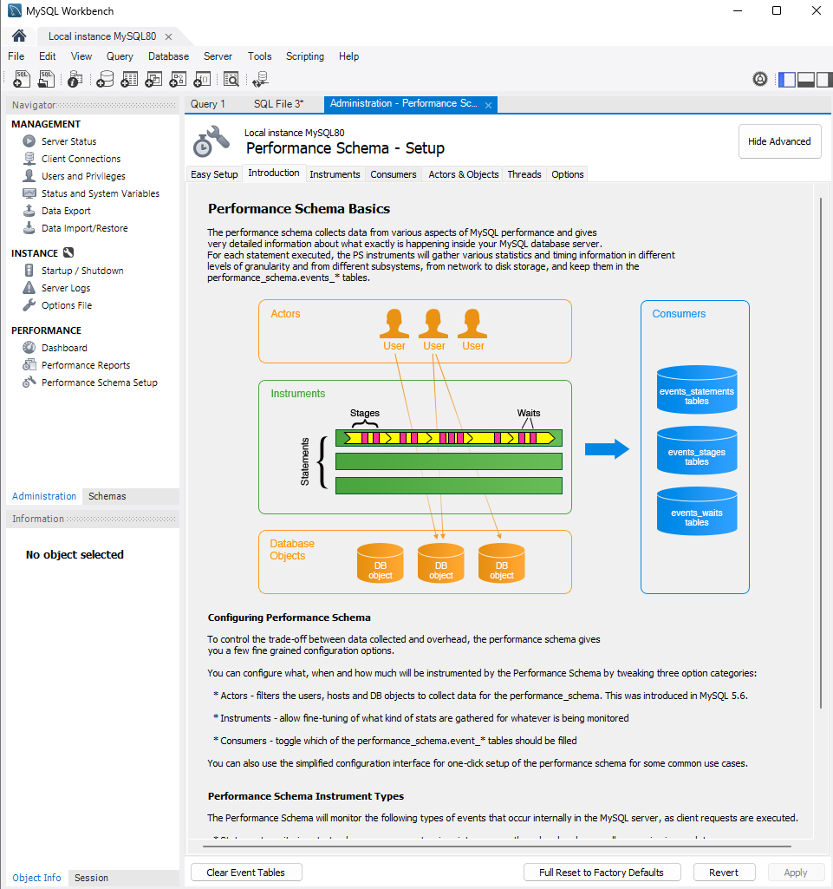
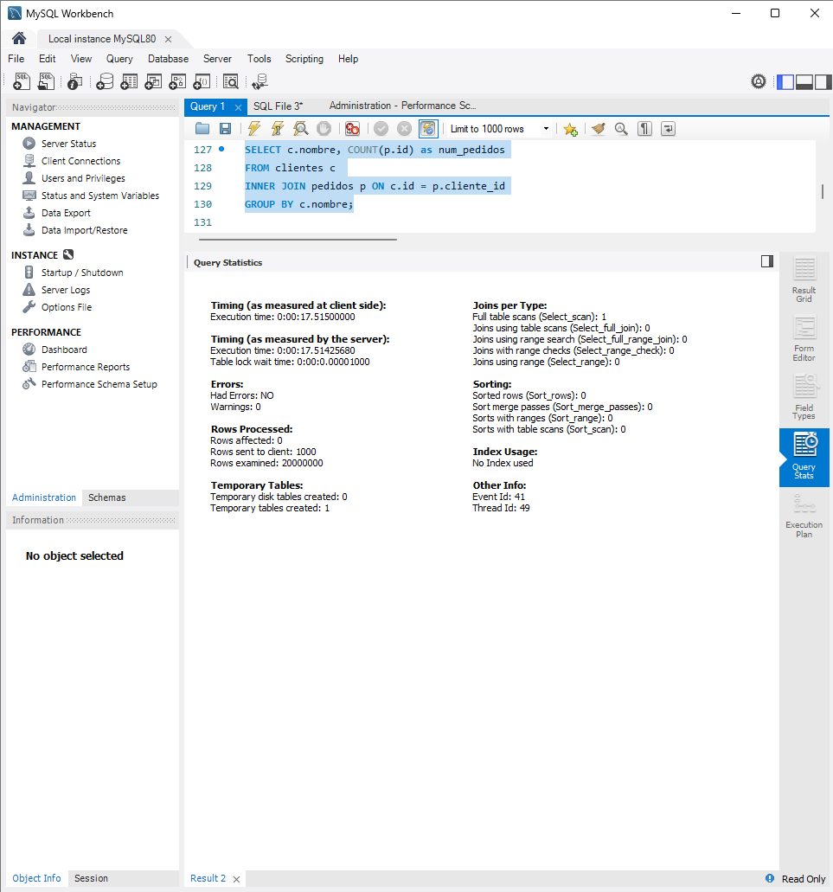
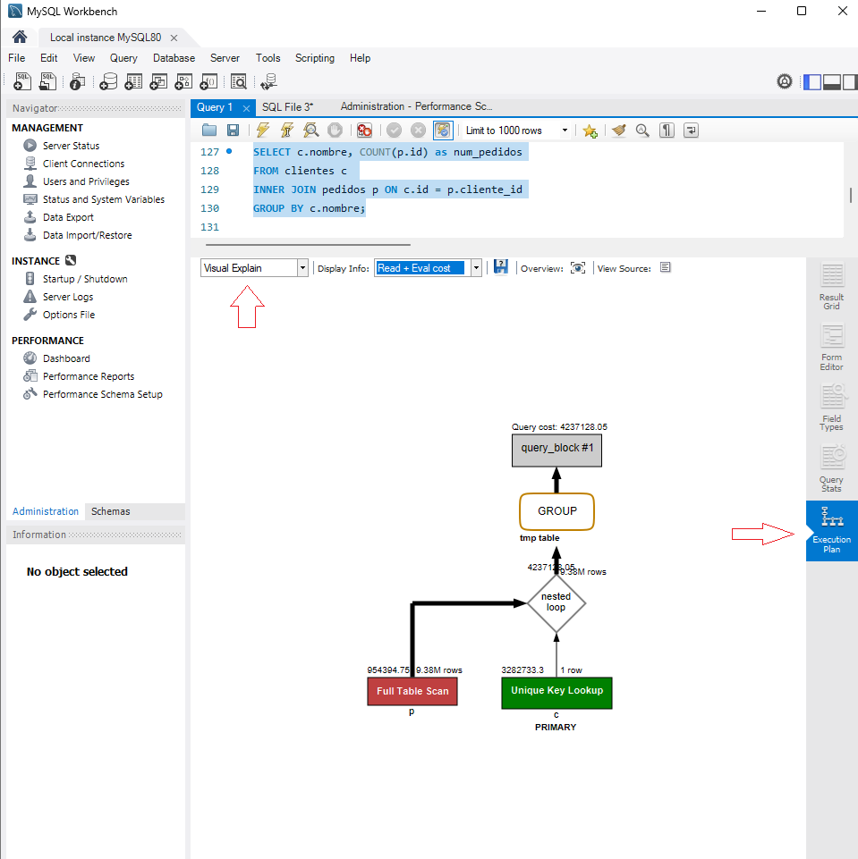

# UD4 - Optimización y Monitorización en SGBD

- [1. Introducción](#1-introducción)
  - [1.1. Aspectos clave a monitorizar](#11-aspectos-clave-a-monitorizar)
- [2. Monitorización mediante variables de estado y de sistema](#2-monitorización-mediante-variables-de-estado-y-de-sistema)
  - [2.1. Consulta de variables de estado y de sistema](#21-consulta-de-variables-de-estado-y-de-sistema)
    - [2.1.1. Carga del servidor](#211-carga-del-servidor)
    - [2.1.2. Eficiencia de consultas](#212-eficiencia-de-consultas)
    - [2.1.3. Bloqueos y concurrencia](#213-bloqueos-y-concurrencia)
    - [2.1.4. Uso de almacenamiento](#214-uso-de-almacenamiento)
- [3. Logs](#3-logs)
  - [3.1. Tipos de logs en MySQL](#31-tipos-de-logs-en-mysql)
  - [3.2. Configuración y activación de logs](#32-configuración-y-activación-de-logs)
  - [3.3. Análisis de logs](#33-análisis-de-logs)
  - [3.4. Rotación de logs](#34-rotación-de-logs)
    - [3.4.1. Herramientas de análisis de logs](#341-herramientas-de-análisis-de-logs)
- [4. Trazas](#4-trazas)
  - [4.1. Diferencias clave entre logs y trazas](#41-diferencias-clave-entre-logs-y-trazas)
  - [4.2. OPTIMIZER\_TRACE](#42-optimizer_trace)
  - [4.3. `EXPLAIN` y `EXPLAIN ANALYZE`](#43-explain-y-explain-analyze)
  - [4.4. `SHOW PROFILE`](#44-show-profile)
- [5. Alertas y notificaciones](#5-alertas-y-notificaciones)
- [6. MySQL Enterprise Monitor](#6-mysql-enterprise-monitor)
- [7. Monitorización en MySQL Workbench](#7-monitorización-en-mysql-workbench)
  - [7.1. Acceso al Performance Dashboard](#71-acceso-al-performance-dashboard)
  - [7.2. Métricas clave en el Performance Dashboard](#72-métricas-clave-en-el-performance-dashboard)
  - [7.3. Herramientas de análisis de rendimiento en MySQL Workbench](#73-herramientas-de-análisis-de-rendimiento-en-mysql-workbench)
    - [7.3.1. Performance Reports](#731-performance-reports)
    - [7.3.2. Performance Schema Setup](#732-performance-schema-setup)
    - [7.3.3. Query Statistics](#733-query-statistics)
    - [7.3.4. Visual Explain](#734-visual-explain)
    - [7.3.5. Herramientas de monotirización en este curso](#735-herramientas-de-monotirización-en-este-curso)
  - [7.4. Limitaciones y consideraciones](#74-limitaciones-y-consideraciones)
  - [7.5. Otras Herramientas de Monitorización](#75-otras-herramientas-de-monitorización)
- [8. Referencias](#8-referencias)
  - [8.1. Documentación oficial](#81-documentación-oficial)
  - [8.2. Monitorización y rendimiento](#82-monitorización-y-rendimiento)

## 1. Introducción

El rendimiento de un sistema gestor de bases de datos puede degradarse con el tiempo debido al crecimiento de los datos, aumento de la carga de usuarios y consultas ineficientes. Para identificar y solucionar estos problemas, es fundamental el uso de herramientas de monitorización que permitan analizar el comportamiento del servidor y la eficiencia de las consultas.

La monitorización en MySQL permite detectar cuellos de botella, prever problemas de rendimiento y garantizar el correcto funcionamiento del sistema. Para ello, es necesario conocer qué aspectos se deben vigilar y qué herramientas proporciona MySQL para hacerlo.  

### 1.1. Aspectos clave a monitorizar  

- **Carga del servidor**: número de conexiones activas, uso de CPU y memoria.  
- **Eficiencia de consultas**: tiempos de ejecución, consultas lentas y uso de índices.  
- **Bloqueos y concurrencia**: transacciones activas, bloqueos de registros y espera de recursos.  
- **Uso de almacenamiento**: tamaño de tablas e índices, crecimiento de registros y fragmentación.  
- **Registro de errores y actividad**: análisis de logs para identificar problemas de configuración o fallos en la base de datos.  

Cada uno de estos aspectos se puede evaluar mediante distintas herramientas de MySQL, como variables de estado, logs o herramientas gráficas. En los siguientes apartados se detallarán estos métodos de monitorización.

## 2. Monitorización mediante variables de estado y de sistema  

Las variables de estado y de sistema en MySQL proporcionan información en tiempo real sobre el funcionamiento del servidor. Permiten analizar la carga, el rendimiento de consultas, el uso de memoria y otros aspectos clave.  

### 2.1. Consulta de variables de estado y de sistema  

A modo de recordatorio, para obtener información sobre las variables disponibles, se pueden utilizar los siguientes comandos:  

```sql
SHOW GLOBAL STATUS;
SHOW SESSION STATUS;
SHOW VARIABLES;
SHOW VARIABLES LIKE 'innodb%';
```

- `SHOW GLOBAL STATUS`: devuelve métricas globales del servidor desde su inicio.  
- `SHOW SESSION STATUS`: muestra métricas específicas de la sesión actual.  
- `SHOW VARIABLES`: lista las variables de configuración del sistema.  
- `SHOW VARIABLES LIKE 'innodb%'`: filtra las variables relacionadas con InnoDB.  

Las métricas más relevantes se pueden organizar en distintas categorías según el aspecto que monitorizan.  

#### 2.1.1. Carga del servidor  

Indica el número de conexiones activas, el uso de recursos y la cantidad de procesos en ejecución.  

| Variable | Descripción |
|----------|------------|
| `Threads_connected` | Número de conexiones activas en el servidor. |
| `Threads_running` | Número de hilos ejecutando consultas en un momento dado. |
| `Max_used_connections` | Máximo número de conexiones simultáneas desde el arranque del servidor. |
| `Connections` | Total de intentos de conexión desde el inicio. |
| `Uptime` | Tiempo en segundos desde el último reinicio del servidor. |

```sql
SHOW GLOBAL STATUS LIKE 'Threads%';
```

#### 2.1.2. Eficiencia de consultas  

Permite evaluar cómo se están ejecutando las consultas y si hay problemas de optimización.  

| Variable | Descripción |
|----------|------------|
| `Slow_queries` | Número de consultas que han tardado más tiempo del definido en `long_query_time`. |
| `Handler_read_rnd_next` | Número de lecturas aleatorias secuenciales; valores altos indican escaneos completos de tablas. |
| `Created_tmp_tables` | Número de tablas temporales creadas en memoria para consultas; valores altos pueden indicar problemas de optimización. |
| `Select_full_join` | Número de consultas que han requerido `JOIN` sin uso de índices. |
| `Select_scan` | Número de consultas que han hecho un escaneo completo de una tabla. |

```sql
SHOW GLOBAL STATUS LIKE 'Slow_queries';
SHOW GLOBAL STATUS LIKE 'Select_scan';
```

Además de consultar estas variables, utilizaremos el comando `EXPLAIN` para analizar el plan de ejecución de consultas y detectar posibles problemas de rendimiento, tal y como vimos en la sección anterior.

```sql
EXPLAIN SELECT * FROM ventas WHERE cliente_id = 10;
```

#### 2.1.3. Bloqueos y concurrencia  

Ayuda a identificar problemas de bloqueo de registros y conflictos entre transacciones.  

| Variable | Descripción |
|----------|------------|
| `Innodb_row_lock_waits` | Número de veces que una transacción ha esperado por un bloqueo de fila. |
| `Innodb_row_lock_time_avg` | Tiempo promedio de espera por bloqueos de filas. |
| `Table_locks_waited` | Número de veces que una consulta ha esperado un bloqueo de tabla. |
| `Transactions` | Número total de transacciones realizadas desde el arranque. |

```sql
SHOW GLOBAL STATUS LIKE 'Innodb_row_lock%';
SHOW GLOBAL STATUS LIKE 'Table_locks_waited';
```

Además, se puede utilizar `SHOW ENGINE INNODB STATUS` para obtener información detallada sobre bloqueos y transacciones en InnoDB.

```sql
SHOW ENGINE INNODB STATUS;
```

#### 2.1.4. Uso de almacenamiento  

Permite analizar el espacio ocupado por tablas e índices y detectar fragmentación.  

| Variable | Descripción |
|----------|------------|
| `Innodb_buffer_pool_pages_data` | Número de páginas en uso en el buffer pool de InnoDB. |
| `Innodb_buffer_pool_read_requests` | Número de lecturas desde el buffer pool sin acceder al disco. |
| `Innodb_data_reads` | Número de lecturas directas desde disco. |
| `Innodb_data_written` | Bytes escritos en disco por InnoDB. |

```sql
SHOW GLOBAL STATUS LIKE 'Innodb_data%';
SHOW GLOBAL STATUS LIKE 'Innodb_buffer%';
```

Además, para analizar el uso de espacio en disco de las tablas de una base de datos, disponemos del comando `SHOW TABLE STATUS`:

```sql
SHOW TABLE STATUS FROM nombre_base_datos;
```

Al ejecutar esta consulta, se obtiene una lista de tablas con información sobre el tamaño en disco, el número de filas, el tipo de motor, etc.

```plaintext
+-----------------+--------+---------+------------+------+----------------+-------------+-----------------+--------------+-----------+----------------+---------------------+-------------+------------+-----------------+----------+----------------+---------+
| Name            | Engine | Version | Row_format | Rows | Avg_row_length | Data_length | Max_data_length | Index_length | Data_free | Auto_increment | Create_time         | Update_time | Check_time | Collation       | Checksum | Create_options | Comment |
+-----------------+--------+---------+------------+------+----------------+-------------+-----------------+--------------+-----------+----------------+---------------------+-------------+------------+-----------------+----------+----------------+---------+
| clientes        | InnoDB |      10 | Dynamic    |    0 |              0 |       16384 |               0 |        16384 |         0 |           NULL | 2025-03-07 16:13:26 | NULL        | NULL       | utf8_general_ci |     NULL |                |         |
| productos       | InnoDB |      10 | Dynamic    |    0 |              0 |       16384 |               0 |        16384 |         0 |           NULL | 2025-03-07 16:13:26 | NULL        | NULL       | utf8_general_ci |     NULL |                |         |
```

Interpretación de los campos más importantes:

1. **Name**: Nombre de la tabla
2. **Engine**: Motor de almacenamiento utilizado (InnoDB, MyISAM, etc.)
3. **Rows**: Número aproximado de filas en la tabla
4. **Avg_row_length**: Tamaño promedio de cada fila en bytes
5. **Data_length**: Tamaño total de los datos en bytes
6. **Index_length**: Tamaño total de los índices en bytes
7. **Data_free**: Espacio fragmentado o no utilizado en bytes

**Cuándo aplicar medidas de optimización**:

1. **Fragmentación alta**:
   - Si `Data_free` es significativamente alto en comparación con `Data_length`
   - Solución: Ejecutar `OPTIMIZE TABLE nombre_tabla`

2. **Índices desproporcionados**:
   - Si `Index_length` es mayor que `Data_length`
   - Solución: Revisar y eliminar índices innecesarios

3. **Tamaño de filas excesivo**:
   - Si `Avg_row_length` es muy alto
   - Solución: Revisar la estructura de la tabla y normalizar si es necesario

4. **Crecimiento descontrolado**:
   - Si `Data_length` crece exponencialmente
   - Solución: Implementar estrategias de particionamiento o archivo histórico

5. **Uso ineficiente del motor**:
   - Si el `Engine` no es el más adecuado para el tipo de operaciones
   - Solución: Migrar a un motor más apropiado (ej: InnoDB para transacciones)

Ejemplo de optimización:

```sql
-- Si detectamos alta fragmentación
OPTIMIZE TABLE clientes;

-- Si necesitamos analizar el uso de índices
SHOW INDEX FROM clientes;

-- Si queremos cambiar el motor de almacenamiento
ALTER TABLE clientes ENGINE = InnoDB;
```

## 3. Logs  

MySQL dispone de varios tipos de **registros** (`logs`) que permiten analizar la actividad del servidor y detectar problemas de rendimiento, errores o cambios en los datos. Los logs almacenan información sobre eventos, actividades o errores que ocurren en el servidor. Son más generales que las trazas.

### 3.1. Tipos de logs en MySQL  

| Log | Descripción | Activación |
|------|------------|------------|
| **General Log** | Registra todas las consultas ejecutadas. | `general_log = ON` |
| **Slow Query Log** | Registra las consultas que superan un tiempo determinado. | `slow_query_log = ON` |
| **Binary Log** | Guarda cambios en la base de datos (para replicación y recuperación). | `log_bin = ON` |
| **Error Log** | Almacena errores y eventos críticos del servidor. | Siempre activo |

Los logs pueden configurarse mediante variables de sistema o en el archivo `my.cnf` (Linux) o `my.ini` (Windows).  

### 3.2. Configuración y activación de logs  

Para verificar qué logs están activados:

```sql
SHOW VARIABLES LIKE '%log%';
```

Para activar o desactivar logs en tiempo de ejecución:

```sql
SET GLOBAL general_log = ON;
SET GLOBAL slow_query_log = ON;
```

Para establecer la ubicación de los archivos de log:  

```sql
SET GLOBAL log_output = 'FILE';
SET GLOBAL general_log_file = '/var/log/mysql/general.log';
SET GLOBAL slow_query_log_file = '/var/log/mysql/slow.log';
```

En `my.cnf` o `my.ini`, se pueden configurar de manera persistente:  

```ini
[mysqld]
general_log = ON
general_log_file = /var/log/mysql/general.log
slow_query_log = ON
slow_query_log_file = /var/log/mysql/slow.log
long_query_time = 2
log_bin = /var/log/mysql/binlog
```

### 3.3. Análisis de logs  

- **General Log**: permite auditar qué consultas se han ejecutado. Puede volverse muy grande rápidamente y afectar el rendimiento.  
- **Slow Query Log**: útil para identificar consultas lentas y optimizarlas. Se puede ajustar el umbral con `long_query_time`.  
- **Binary Log**: esencial para replicación y recuperación de datos tras fallos. Se administra con `mysqlbinlog`.  
- **Error Log**: registra problemas en el servidor, errores de conexión y fallos en transacciones.  

Para ver las últimas entradas de un log desde el sistema operativo:

```bash
tail -f /var/log/mysql/slow.log
```

Cada uno de estos logs proporciona información valiosa para diagnosticar problemas y mejorar el rendimiento del sistema.

Por ejemplo, una vez activado, el log general registra todas las consultas ejecutadas en el servidor. Es útil para identificar consultas lentas o ineficientes, aunque puede generar un gran volumen de datos, por lo que se recomienda **desactivarlo** cuando no sea necesario.

```plaintext
C:\Program Files\MySQL\MySQL Server 8.0\bin\mysqld.exe, Version: 8.0.41 (MySQL Community Server - GPL). started with:
TCP Port: 3306, Named Pipe: MySQL
Time                 Id Command    Argument
2025-03-07T16:13:26.343519Z	   10 Query	SET GLOBAL general_log_file = '/var/log/mysql/general.log'
2025-03-07T16:13:39.224698Z	   10 Query	show variables like 'general_log_file'
2025-03-07T16:13:39.233706Z	    9 Query	SELECT st.* FROM performance_schema.events_statements_current st JOIN performance_schema.threads thr ON thr.thread_id = st.thread_id WHERE thr.processlist_id = 10
2025-03-07T16:13:39.234350Z	    9 Query	SELECT st.* FROM performance_schema.events_stages_history_long st WHERE st.nesting_event_id = 38
2025-03-07T16:13:39.234665Z	    9 Query	SELECT st.* FROM performance_schema.events_waits_history_long st WHERE st.nesting_event_id = 38
2025-03-07T16:14:08.939951Z	   10 Query	show variables like '%general_log%'
2025-03-07T16:14:08.953035Z	    9 Query	SELECT st.* FROM performance_schema.events_statements_current st JOIN performance_schema.threads thr ON thr.thread_id = st.thread_id WHERE thr.processlist_id = 10
2025-03-07T16:14:08.953837Z	    9 Query	SELECT st.* FROM performance_schema.events_stages_history_long st WHERE st.nesting_event_id = 40
2025-03-07T16:14:08.954180Z	    9 Query	SELECT st.* FROM performance_schema.events_waits_history_long st WHERE st.nesting_event_id = 40
2025-03-07T16:15:08.885401Z	   10 Query	SHOW GLOBAL STATUS LIKE 'Slow_queries'
2025-03-07T16:15:08.903096Z	    9 Query	SELECT st.* FROM performance_schema.events_statements_current st JOIN performance_schema.threads thr ON thr.thread_id = st.thread_id WHERE thr.processlist_id = 10
2025-03-07T16:15:08.903801Z	    9 Query	SELECT st.* FROM performance_schema.events_stages_history_long st WHERE st.nesting_event_id = 42
2025-03-07T16:15:08.904268Z	    9 Query	SELECT st.* FROM performance_schema.events_waits_history_long st WHERE st.nesting_event_id = 42
2025-03-07T16:16:39.380725Z	   10 Query	show variables like 'slow_query_log'
2025-03-07T16:16:39.402303Z	    9 Query	SELECT st.* FROM performance_schema.events_statements_current st JOIN performance_schema.threads thr ON thr.thread_id = st.thread_id WHERE thr.processlist_id = 10
```

### 3.4. Rotación de logs

La rotación de logs es un proceso esencial para gestionar el espacio en disco y mantener un historial de registros sin que estos crezcan indefinidamente. En MySQL, los logs pueden crecer rápidamente, especialmente si se activan logs detallados como el **General Log** o el **Slow Query Log**. La **rotación de logs** consiste en archivar los logs antiguos y crear nuevos archivos de logs para evitar que un solo archivo crezca demasiado. Esto ayuda a mantener el sistema organizado y evita que los logs consuman todo el espacio en disco.

**Métodos para rotar logs en MySQL**:

- **Rotación manual**:
  - Detener el servidor MySQL temporalmente (si es posible).
  - Renombrar el archivo de log actual (por ejemplo, `mysql.log` a `mysql.log.1`).
  - Reiniciar el servidor MySQL para que cree un nuevo archivo de log.
- **Rotación automática**:
  - Usar herramientas como **logrotate** en sistemas Linux para automatizar la rotación de logs.

**Configuración de MySQL para rotación de logs**:

- **Binary Logs**: MySQL permite configurar la expiración de binary logs usando la variable `expire_logs_days`.
  
  ```sql
  SET GLOBAL expire_logs_days = 7;
  ```

  Esto eliminará automáticamente los binary logs que tengan más de 7 días. Si el valor es 0, la eliminación automática estará desactivada.
- **Error Log y General Log**: Estos logs no tienen una rotación automática integrada en MySQL, por lo que es necesario usar herramientas externas como `logrotate`.

**Consideraciones**:

- **Espacio en disco**: Asegúrate de tener suficiente espacio en disco para almacenar los logs rotados.
- **Retención**: Define políticas de retención para decidir cuánto tiempo conservar los logs antiguos.
- **Comprimir logs**: Comprimir logs antiguos puede ahorrar espacio en disco.

#### 3.4.1. Herramientas de análisis de logs

El análisis de logs es crucial para identificar problemas de rendimiento, errores o patrones de uso en la base de datos. Aquí te presento algunas herramientas útiles para analizar logs en MySQL:

**Herramientas nativas de MySQL**:

- **`Slow Query Log`**:
  - MySQL permite habilitar el registro de consultas lentas para identificar consultas que superan un umbral de tiempo.
  - Ejemplo de configuración:

   ```sql
   SET GLOBAL slow_query_log = 'ON';
   SET GLOBAL long_query_time = 2; -- Consultas que tardan más de 2 segundos
   ```

- Uso de `mysqldumpslow` para analizar el Slow Query Log:

   ```bash
   mysqldumpslow /var/log/mysql/slow.log
   ```

- **Herramientas externas**:
  - **pt-query-digest (Percona Toolkit)**: Es una herramienta avanzada para analizar logs de consultas lentas y generar informes detallados.
    - Ejemplo de uso:

    ```bash
    pt-query-digest /var/log/mysql/slow.log
    ```

  - Proporciona estadísticas como el tiempo total de ejecución, el número de ejecuciones y las consultas más problemáticas.
  - Otras herramientas, como **MySQL Enterprise Monitor**, **ELK Stack (Elasticsearch, Logstash, Kibana)**, **Sentry**, etc.

- **Análisis de logs con scripts personalizados**:
  - Puedes crear scripts en Bash, Python o Perl para analizar logs de manera personalizada.

## 4. Trazas

Las trazas son registros detallados y específicos de la actividad del sistema. Se utilizan para depurar o analizar el sistema de una manera más profunda. En MySQL, no hay un mecanismo de trazas nativo detallado, pero si varias formas de obtener información detallada sobre las consultas y el funcionamiento interno del motor, que en realidad, ya hemos visto en apartados previos.

### 4.1. Diferencias clave entre logs y trazas

| **Característica**       | **Logs**                                      | **Trazas**                                   |
|--------------------------|-----------------------------------------------|---------------------------------------------|
| **Propósito**            | Registrar eventos importantes o errores.      | Depurar y analizar el comportamiento interno. |
| **Nivel de detalle**     | General (información resumida).               | Muy detallado (información técnica específica). |
| **Uso principal**        | Auditoría, diagnóstico, cumplimiento.         | Depuración, optimización, análisis técnico. |
| **Ejemplos en MySQL**    | Error Log, General Log, Slow Query Log.       | Trazas de consultas, transacciones, errores. |
| **Activo por defecto**   | Algunos logs están activos (Error Log).       | Normalmente se activan bajo demanda.        |

### 4.2. OPTIMIZER_TRACE

Un mecanismo de traza útil en MySQL es `OPTIMIZER_TRACE`, que muestra el plan de ejecución de una consulta y los índices utilizados, como hemos visto en la sección UD4_1 (apartado 2.4.1). Recordamos que para activarla:

```sql
SET optimizer_trace = 'enabled=on';
```

### 4.3. `EXPLAIN` y `EXPLAIN ANALYZE`

Además de `OPTIMIZER_TRACE`, MySQL proporciona las instrucciones `
`EXPLAIN` y `EXPLAIN ANALYZE` para analizar el plan de ejecución de consultas. Estas instrucciones permiten visualizar cómo MySQL ejecuta una consulta y qué índices utiliza.

### 4.4. `SHOW PROFILE`

Otra herramienta útil para analizar el rendimiento de consultas es `SHOW PROFILE`. Esta instrucción muestra información detallada sobre el tiempo de ejecución de una consulta, incluyendo el tiempo total, el tiempo de CPU y el tiempo de espera.

```sql
SHOW PROFILE FOR QUERY 1;
```

La instrucción anterior muestra el perfil de ejecución de la consulta con ID 1. Se puede utilizar para identificar cuellos de botella y optimizar consultas.

```plaintext
+----------------------+----------+
| Status               | Duration |
+----------------------+----------+
| starting             | 0.000032 |
| checking permissions | 0.000006 |
| Opening tables       | 0.000013 |
| query end            | 0.000006 |
| closing tables       | 0.000006 |
| cleaning up          | 0.000006 |
```

Para visualizar el profiling, es necesario activarlo:

```sql
SET profiling = 1;
```

Tal y como se indica en la [documentación oficial](https://dev.mysql.com/doc/refman/8.4/en/show-profile.html), el comando `SHOW PROFILE` está deprecado y se espera que sea eliminado en futuras versiones de MySQL, y se recomienda el uso de Performance Schema en su lugar, que veremos a continuacion.

## 5. Alertas y notificaciones

Algunas herramientas permiten configurar alertas basadas en umbrales críticos de rendimiento, como el número de conexiones activas, el uso de CPU o el tiempo de respuesta de consultas. Esto permite reaccionar antes de que un problema afecte a los usuarios.

En MySQL, las alertas pueden revisarse mediante:

- **`SHOW WARNINGS`**: Muestra advertencias generadas por el servidor.
- **`SHOW ERRORS`**: Muestra errores generados por el servidor.

Para configurar alertas personalizadas, se pueden utilizar herramientas de monitorización como **MySQL Enterprise Monitor**, **Nagios**, **Zabbix**, **Prometheus**, o **Percona Monitoring and Management (PMM)**.

## 6. MySQL Enterprise Monitor

Es una solución oficial de MySQL que ofrece:

- Supervisión en tiempo real del servidor.
- Detección de consultas lentas y posibles bloqueos.
- Alertas personalizadas para distintos parámetros de rendimiento.
- Recomendaciones automáticas para optimización.

En cualquier caso, se encuentra descatalogada y sin soporte desde el 1 de enero de 2025 (ver [*End of Life Notice*](https://dev.mysql.com/doc/mysql-monitor/8.0/en/mem-eol.html)) y se recomienda el uso de otras herramientas más modernas.

## 7. Monitorización en MySQL Workbench

MySQL Workbench es una herramienta gráfica integral para administrar y optimizar bases de datos MySQL. Una de sus funcionalidades más potentes es el **Performance Dashboard**, que permite monitorizar y analizar el rendimiento de la base de datos de manera visual e intuitiva. A continuación, te explico cómo aprovechar esta herramienta.

El Performance Dashboard es un panel de control integrado en MySQL Workbench que proporciona una visión general del rendimiento de la base de datos.Muestra métricas clave en tiempo real, como el uso de CPU, memoria, conexiones, consultas lentas y más.

Nos permite, entre otras cosas, identificar cuellos de botella en el rendimiento, monitorizar el estado de la base de datos de manera proactiva, o tomar decisiones informadas para optimizar el rendimiento.

### 7.1. Acceso al Performance Dashboard

1. Abre MySQL Workbench y conéctate a tu servidor MySQL.
2. En la pantalla principal, selecciona **Performance** en el menú lateral.
3. Haz clic en **Performance Dashboard** para abrir el panel de control.



### 7.2. Métricas clave en el Performance Dashboard

El Performance Dashboard muestra varias secciones con métricas importantes:

1. **Network Status**: muestra estadísticas sobre el trafico de red enviado y recibido por el servidor MySQL.
   1. Trafico de red entrante (bytes/s).
   2. Trafico de red saliente (bytes/s).
   3. Conexiones activas.
2. **MySQL Status**: muestra la actividad primaria del servidor SQL y estadísticas de rendimiento
   1. Table Open Cache: número de tablas abiertas en la caché.
   2. Sentencias SQL ejecutadas
   3. Tasas de sentencias SQL por segundo.
3. **Innodb Status**: muestra estadísticas sobre el InnoDB Buffer Pool y la actividad de disco generada por el motor de almacenamiento InnoDB. El buffer pool es una memoria caché que almacena datos e índices de tablas InnoDB para mejorar el rendimiento. El buffer pool permite acceder directamente a datos utilizados con frecuencia, lo que acelera el procesamiento de datos. En servidores dedicados, hasta el 80% de la memoria física se suele asignar al buffer pool. Se puede configurar a traves de diferentes variables del sistema.
   1. **InnoDB Buffer Pool**: tamaño y uso del buffer pool de InnoDB, así como peticiones de lectura y escritura.
   2. **InnoDB Disk Writes**: estadísticas sobre escrituras en disco realizadas por InnoDB (bytes/s, escrituras/s).
   3. **InnoDB Disk Reads**: estadísticas sobre lecturas desde disco realizadas por InnoDB (bytes/s).

### 7.3. Herramientas de análisis de rendimiento en MySQL Workbench

Además del Performance Dashboard, MySQL Workbench incluye otras herramientas útiles para analizar y optimizar el rendimiento:

#### 7.3.1. Performance Reports

- Genera informes detallados sobre el rendimiento del servidor.
- Incluye métricas como el uso de recursos, estadísticas de consultas y estado de InnoDB.
- Se accede desde **Performance** > **Performance Reports**.



#### 7.3.2. Performance Schema Setup

Permite configurar y ajustar la configuración de Performance Schema, una herramienta de diagnóstico avanzada en MySQL que proporciona información detallada sobre el rendimiento del servidor. Tiene un modo de configuración simple, aunque se pueden activar o desactivar las opciones avanzadas según sea necesario.





El **MySQL Performance Schema** tiene, entre otras, las siguientes características:

- Recolección de métricas en tiempo real sin afectar significativamente el rendimiento.
- Monitoreo detallado de consultas, esperas, transacciones y uso de recursos.
- Uso de tablas dentro de `performance_schema`, accesibles con SELECT.
- Control sobre qué eventos se registran y cuánta memoria se asigna a la captura de datos.
- Integración con la vista sys, que facilita la interpretación de datos de monitoreo.

Para **verificar si está activado:**

```sql
SHOW VARIABLES LIKE 'performance_schema';
```

Si devuelve `OFF`, significa que está deshabilitado.  

**Activarlo temporalmente (hasta reiniciar MySQL):**

```sql
SET GLOBAL performance_schema = ON;
```

**Activarlo de forma permanente en `my.cnf` o `my.ini`:**

```ini
[mysqld]
performance_schema=ON
```

**Reiniciar MySQL** después de hacer cambios.  

**Componentes clave de Performance Schema**:

| **Componente** | **Descripción** |
|---------------|----------------|
| **Setup Tables** | Configuran qué eventos se registran y qué instrumentos están activos. |
| **Event Tables** | Contienen los eventos capturados, como consultas ejecutadas, esperas y bloqueos. |
| **Summaries Tables** | Resumen de métricas agregadas (ej. tiempo total en consultas, bloqueos más frecuentes). |
| **Instance Tables** | Información sobre objetos específicos como conexiones, tablas o índices. |
| **Memory Tables** | Uso de memoria dentro del Performance Schema. |

**Configuración y personalización**: Performance Schema permite ajustar qué datos se recopilan para **minimizar el impacto en el rendimiento**.  

**Habilitar la captura de eventos de consultas:**

```sql
UPDATE performance_schema.setup_instruments 
SET ENABLED = 'YES', TIMED = 'YES' 
WHERE NAME LIKE 'statement/sql/%';
```

**Activar la captura de eventos en el historial:**
```sql
UPDATE performance_schema.setup_consumers 
SET ENABLED = 'YES' 
WHERE NAME = 'events_statements_history';
```

**Consultas útiles para monitoreo**:

- **Ver consultas lentas ejecutadas recientemente:**

  ```sql
  SELECT sql_text, timer_wait / 1000000000 AS tiempo_ms
  FROM performance_schema.events_statements_history
  ORDER BY timer_wait DESC
  LIMIT 10;
  ```

- **Ver las tablas más utilizadas:**

  ```sql
  SELECT OBJECT_SCHEMA, OBJECT_NAME, COUNT_STAR
  FROM performance_schema.table_io_waits_summary_by_table
  ORDER BY COUNT_STAR DESC
  LIMIT 5;
  ```

- **Ver los bloqueos más frecuentes:**

  ```sql
  SELECT EVENT_NAME, COUNT_STAR
  FROM performance_schema.events_waits_summary_global_by_event_name
  ORDER BY COUNT_STAR DESC
  LIMIT 5;
  ```

#### 7.3.3. Query Statistics

Cuando ejecutamos una consulta en MySQL Workbench, podemos ver estadísticas detalladas sobre su rendimiento, como el tiempo de ejecución, el número de filas afectadas y el uso de índices. Esto nos permite identificar cuellos de botella y optimizar las consultas según sea necesario.



#### 7.3.4. Visual Explain

Al igual que *Query Statistics*, *Visual Explain* es una herramienta que nos permite analizar el plan de ejecución de una consulta de manera visual.

- Proporciona una representación gráfica del plan de ejecución de una consulta.
- Ayuda a entender cómo MySQL ejecuta una consulta y a identificar cuellos de botella.
- Se accede desde la pestaña **Query** > **Execution Plan** > **Explain**.



#### 7.3.5. Herramientas de monotirización en este curso

**No es objetivo de este curso profundizar en el uso de estas herramientas**, pero es importante conocer su existencia y cómo acceder a ellas en caso de necesidades laborales futuras. En cualquier caso, se recomienda consultar la [documentación oficial de MySQL Workbench](https://dev.mysql.com/doc/workbench/en/) para obtener más información sobre estas herramientas acceder a ellas.

### 7.4. Limitaciones y consideraciones

- **Requerimientos de acceso**:
  - Para usar el Performance Dashboard, necesitas permisos de superusuario en el servidor MySQL.
- **Impacto en el rendimiento**:
  - El uso continuo del Performance Dashboard puede consumir recursos del servidor, especialmente en entornos con alta carga.
- **Alternativas para entornos críticos**:
  - En entornos de producción críticos, considera usar herramientas externas como Percona Monitoring and Management (PMM) o Zabbix para monitorización continua.

### 7.5. Otras Herramientas de Monitorización

- **Percona Monitoring and Management (PMM)**: Plataforma gratuita que permite visualizar métricas de rendimiento y detectar problemas en bases de datos MySQL.
- **Zabbix**: Herramienta de monitorización de sistemas y bases de datos que permite configurar alertas y visualizar datos en dashboards.
- **Nagios**: Monitorea la disponibilidad y rendimiento del servidor MySQL, generando notificaciones ante incidencias.
- **Grafana + Prometheus**: Solución moderna para la recolección y visualización de métricas en bases de datos.

## 8. Referencias

### 8.1. Documentación oficial

- MySQL Documentation. (2024). *MySQL Server Administration*. Oracle Corporation. <https://dev.mysql.com/doc/refman/8.0/en/server-administration.html>
- MySQL Documentation. (2024). *MySQL Performance Schema*. Oracle Corporation. <https://dev.mysql.com/doc/refman/8.0/en/performance-schema.html>
- MySQL Documentation. (2024). *Server Logs*. Oracle Corporation. <https://dev.mysql.com/doc/refman/8.0/en/server-logs.html>

### 8.2. Monitorización y rendimiento

- Bell, C., Kindahl, M., & Thalmann, L. (2021). *MySQL High Availability: Tools for Building Robust Data Centers* (3rd ed.). O'Reilly Media.
- Schwartz, B., Zaitsev, P., & Tkachenko, V. (2023). *High Performance MySQL: Optimization, Backups, Replication, and More* (5th ed.). O'Reilly Media.
- Pachev, S. (2020). *Understanding MySQL Internals: Discovering and Improving a Great Database* (2nd ed.). O'Reilly Media.
- Cabral, S., & Murphy, K. (2022). *MySQL Administrator's Bible* (2nd ed.). Wiley Publishing.
- DuBois, P. (2020). *MySQL Cookbook: Solutions for Database Developers and Administrators* (4th ed.). O'Reilly Media.
